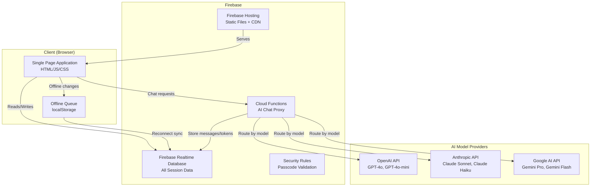
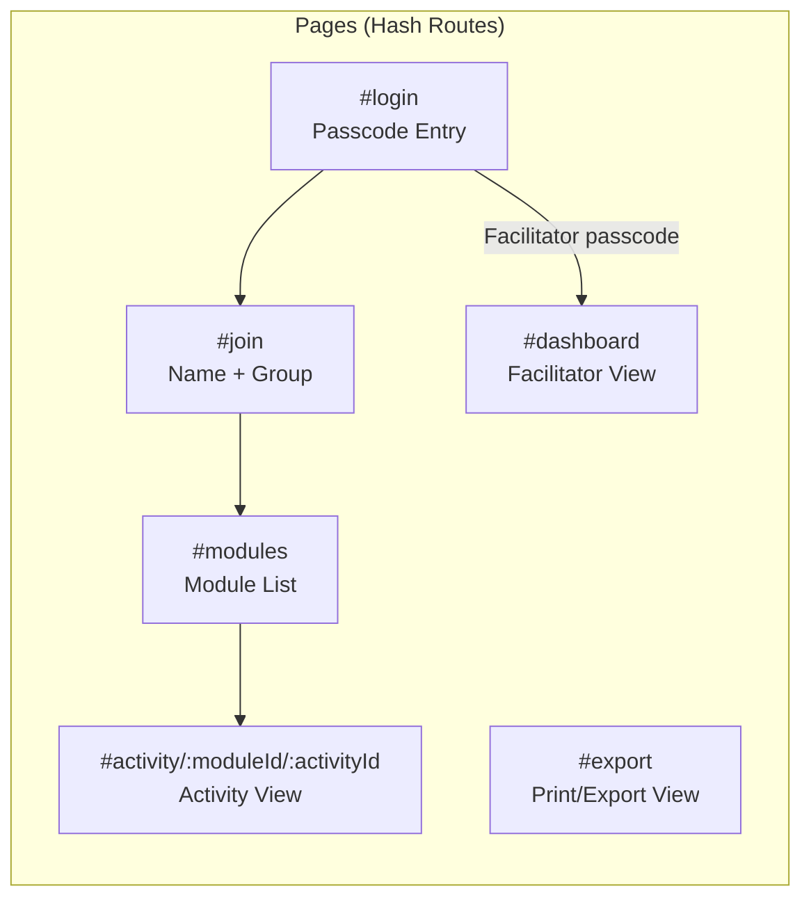
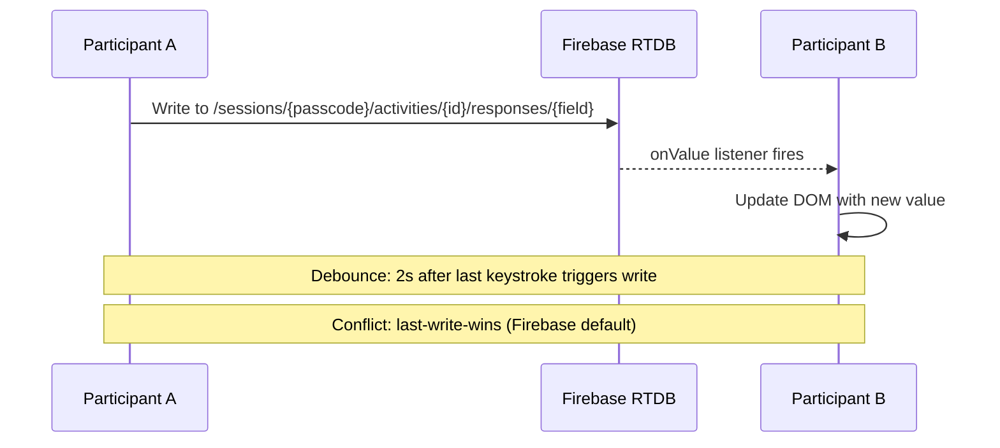
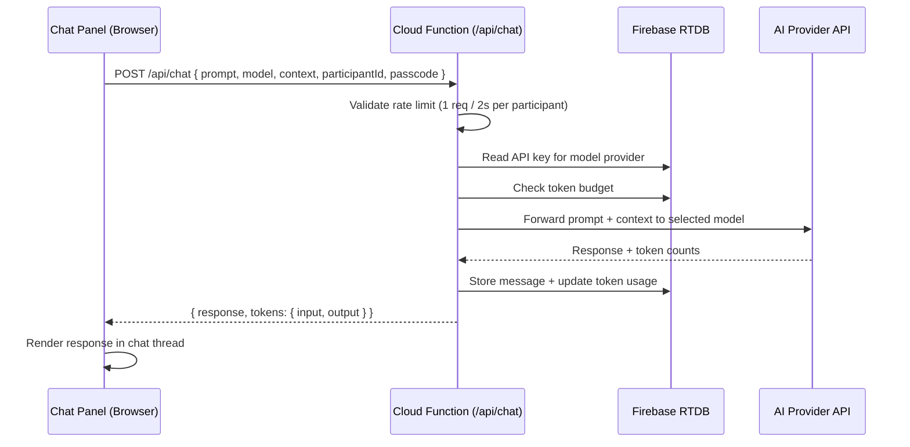
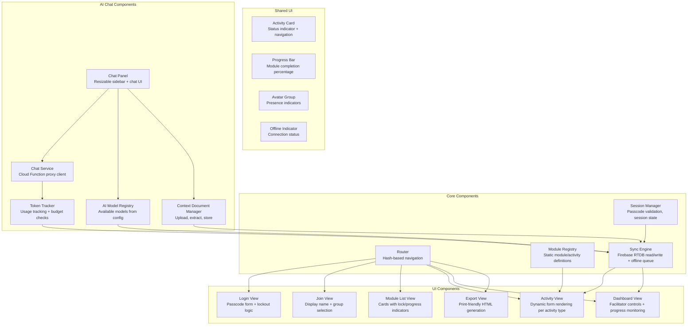

# Design Document: AI Essentials Exercise Platform

## Overview

The AI Essentials Exercise Platform is a real-time collaborative web application that supports a 10-module professional AI training course. It follows the proven architecture of the existing QE Training platform: Firebase Realtime Database for synchronisation, Firebase Hosting for deployment, vanilla HTML/JS for the frontend (single-page app approach), passcode-based session gating, and a cards-based UI with colour-coded status indicators.

### Key Design Decisions

| Decision | Choice | Rationale |
|----------|--------|-----------|
| Backend | Firebase Realtime Database | Proven pattern from QE Training; real-time sync built-in; serverless; no backend code to maintain |
| Frontend | Vanilla HTML/JS (SPA) | No build step; simple deployment to Firebase Hosting; matches existing QE Training approach |
| Authentication | Passcode-only (no Firebase Auth) | Minimises data collection; matches privacy requirements; simple UX for non-technical users |
| Hosting | Firebase Hosting | Integrated with RTDB; global CDN; simple deployment via `firebase deploy` |
| State Management | Firebase RTDB listeners + local DOM state | Real-time sync via `onValue`/`onChildChanged`; minimal client-side complexity |
| Styling | Single CSS file with CSS custom properties | Consistent theming; print-friendly CSS via `@media print`; responsive via CSS Grid/Flexbox |
| Offline | Local queue with reconnection sync | Firebase RTDB has built-in offline persistence; augmented with custom queue for the 50-change cap |
| AI Chat Proxy | Firebase Cloud Function | API keys must never be exposed to client-side JavaScript; server-side proxy handles authentication, rate limiting, and routing to model providers |
| AI Model Integration | Multi-provider via proxy | OpenAI, Anthropic, and Google APIs accessed through a single Cloud Function endpoint; enables facilitator-controlled model availability |

### High-Level Architecture



## Architecture

### Application Structure

The platform is a single-page application with hash-based routing. All navigation happens client-side without full page reloads.



### Real-Time Sync Architecture



### Module Content Architecture

Each module's activities are defined in a static configuration object within the JavaScript code. This keeps module definitions version-controlled and avoids database schema complexity. Activity responses (participant work) are stored in Firebase RTDB.

```
Module Definition (JS static config)     →  Activity structure, field definitions, validation rules
Activity Responses (Firebase RTDB)        →  Participant inputs, completion status, timestamps
```

### AI Chat Architecture

The embedded AI chat feature uses a server-side proxy pattern to securely route participant prompts to AI model providers without exposing API keys to the client.



**Key architectural decisions:**

1. **Server-side proxy (Cloud Function)**: API keys are stored in Firebase RTDB under a server-only path (secured via Firebase Security Rules). The Cloud Function reads keys at request time and forwards to the appropriate provider. Keys never reach the client.

2. **Rate limiting**: The Cloud Function enforces a maximum of 1 request per 2 seconds per participant using an in-memory timestamp map (reset per cold start, backed by RTDB write timestamps for persistence across instances).

3. **Comparison mode**: When comparison is active, the Cloud Function receives a single request with two model selections, makes parallel API calls, and returns both responses in a single response payload.

4. **Context document handling**: The client sends the context document text along with each prompt. The Cloud Function assembles the full prompt by prepending the context with a delimiter (`--- PERSONAL CONTEXT ---\n{contextText}\n--- END CONTEXT ---\n\n{userPrompt}`).

5. **Token budget enforcement**: Before forwarding a prompt, the Cloud Function reads the current cumulative token usage and budget from RTDB. If usage >= budget, the request is rejected with a `TOKEN_BUDGET_EXCEEDED` error.

## Components and Interfaces

### Component Overview



### Key Interfaces

#### SessionManager

```javascript
// SessionManager - manages session lifecycle
const SessionManager = {
  createSession(facilitatorId, sessionName) → { passcode, sessionRef }
  validatePasscode(input) → { valid: boolean, sessionData? }
  getActiveSession() → sessionData | null
  deleteSession(passcode) → void
  isLockedOut(clientId) → { locked: boolean, remainingSeconds? }
  recordFailedAttempt(clientId) → void
}
```

#### SyncEngine

```javascript
// SyncEngine - handles Firebase RTDB operations + offline queue
const SyncEngine = {
  // Write with debounce (2s)
  debouncedWrite(path, value) → void
  
  // Direct write (no debounce)
  immediateWrite(path, value) → void
  
  // Subscribe to path changes
  subscribe(path, callback) → unsubscribeFn
  
  // Offline queue management
  queueChange(path, value) → { queued: boolean, queueSize: number }
  flushQueue() → Promise<void>
  getQueueSize() → number
  
  // Connection state
  onConnectionChange(callback) → unsubscribeFn
}
```

#### ModuleRegistry

```javascript
// ModuleRegistry - static module/activity configuration
const ModuleRegistry = {
  getModule(moduleId) → ModuleDefinition
  getActivity(moduleId, activityId) → ActivityDefinition
  getAllModules() → ModuleDefinition[]
  getFieldValidation(moduleId, activityId, fieldId) → ValidationRules
}
```

#### ActivityView (Dynamic Rendering)

```javascript
// ActivityView renders activity forms based on field definitions
const ActivityView = {
  render(activityDef, existingResponses, isReadOnly) → HTMLElement
  validateField(fieldId, value, rules) → { valid: boolean, error? }
  getCompletionStatus(activityDef, responses) → 'not_started' | 'in_progress' | 'completed'
}
```

### Activity Field Types

Activities are composed of typed fields. The ActivityView dynamically renders the appropriate input control for each field type:

| Field Type | HTML Rendering | Validation |
|------------|---------------|------------|
| `text` | `<input type="text">` | minLength, maxLength |
| `textarea` | `<textarea>` | minLength, maxLength |
| `checklist` | `<input type="checkbox">` per item | all items checked for completion |
| `select` | `<select>` or radio buttons | required selection |
| `rating` | Star/number scale | min, max values |
| `file_upload` | `<input type="file">` | accepted formats, max size |
| `structured_table` | Dynamic table rows | min rows, column validation |
| `readonly_display` | `<div>` with content | N/A |

### AI Chat Component Interfaces

#### ChatPanel

```javascript
// ChatPanel - Resizable sidebar with chat UI, model selector, compare toggle
const ChatPanel = {
  open(moduleId, activityId) → void       // Open panel with activity context
  close() → void                           // Minimize to collapsed icon
  resize(width) → number                   // Returns clamped width [300, 800]
  getState() → { open: boolean, width: number, mode: 'single' | 'compare' }
  toggleCompareMode() → void               // Switch between single and compare
  submitPrompt(text) → Promise<ChatResponse>
  submitComparisonPrompt(text) → Promise<ComparisonResponse>
  loadHistory(participantId, passcode) → Promise<ChatMessage[]>
}
```

#### ChatService

```javascript
// ChatService - Client-side service communicating with Cloud Function proxy
const ChatService = {
  // Send a prompt to a single model
  sendPrompt({ prompt, model, context, participantId, passcode }) → Promise<{
    content: string,
    tokens: { input: number, output: number },
    model: string
  }>
  
  // Send a prompt to two models for comparison
  sendComparisonPrompt({ prompt, models: [string, string], context, participantId, passcode }) → Promise<{
    responses: [
      { content: string, tokens: { input, output }, model: string },
      { content: string, tokens: { input, output }, model: string } | { error: string, model: string }
    ]
  }>
  
  // Check if rate limit allows a new request
  canSendPrompt(participantId) → boolean
}
```

#### AIModelRegistry (Chat)

```javascript
// AIModelRegistry (Chat) - Manages available models based on facilitator config
const AIModelRegistry = {
  // Get all models enabled for this session
  getAvailableModels(passcode) → ModelDefinition[]
  
  // Subscribe to model availability changes
  onModelsChanged(passcode, callback) → unsubscribeFn
  
  // Provider-to-models mapping
  getModelsForProvider(provider) → string[]
  // OpenAI → ['gpt-4o', 'gpt-4o-mini']
  // Anthropic → ['claude-sonnet', 'claude-haiku']
  // Google → ['gemini-pro', 'gemini-flash']
  
  // Check if a specific model is currently available
  isModelAvailable(passcode, modelId) → boolean
  
  // Get first available model (for auto-switch fallback)
  getDefaultModel(passcode) → string | null
}
```

#### ContextDocumentManager

```javascript
// ContextDocumentManager - Handles upload, text extraction, storage of context docs
const ContextDocumentManager = {
  // Upload and extract text from a file
  upload(file, participantId, passcode) → Promise<{
    success: boolean,
    error?: 'UNSUPPORTED_FORMAT' | 'SIZE_EXCEEDED' | 'EXTRACTION_FAILED',
    extractedText?: string
  }>
  
  // Validate file before processing
  validateFile(file) → { valid: boolean, error?: string }
  // Accepted: .txt, .pdf, .md
  // Max extracted text size: 51,200 characters (50 KB)
  
  // Get current context document text
  getContextText(participantId, passcode) → Promise<string | null>
  
  // Remove context document
  removeDocument(participantId, passcode) → Promise<void>
  
  // Replace document (upload new, remove old)
  replaceDocument(file, participantId, passcode) → Promise<{ success, error?, extractedText? }>
}
```

#### TokenTracker

```javascript
// TokenTracker - Tracks and reports token usage per participant and session
const TokenTracker = {
  // Record tokens for a single interaction
  recordUsage(participantId, passcode, tokens: { input: number, output: number }) → Promise<void>
  
  // Get participant's total usage
  getParticipantUsage(participantId, passcode) → Promise<number>
  
  // Get session-wide total usage
  getSessionUsage(passcode) → Promise<number>
  
  // Get usage breakdown per participant (for facilitator dashboard)
  getUsageBreakdown(passcode) → Promise<{ [participantId]: number }>
  
  // Check if budget allows another request
  checkBudget(passcode) → Promise<{ allowed: boolean, usage: number, budget: number | null, percentage: number }>
  
  // Subscribe to usage changes (for real-time dashboard updates)
  onUsageChanged(passcode, callback) → unsubscribeFn
}
```

### Firebase Cloud Function: `/api/chat`

**Endpoint**: `POST /api/chat`

**Request body**:
```json
{
  "prompt": "string (user's message text)",
  "model": "string (e.g., 'gpt-4o', 'claude-sonnet')",
  "context": "string | null (extracted context document text)",
  "participantId": "string",
  "passcode": "string",
  "isComparison": "boolean",
  "comparisonModel": "string | null (second model for comparison mode)"
}
```

**Response body (success)**:
```json
{
  "content": "string (AI model response)",
  "tokens": { "input": 150, "output": 230 },
  "model": "gpt-4o",
  "comparison": {
    "content": "string | null",
    "tokens": { "input": 150, "output": 195 },
    "model": "claude-sonnet",
    "error": "string | null"
  }
}
```

**Response body (error)**:
```json
{
  "error": "RATE_LIMITED | TOKEN_BUDGET_EXCEEDED | MODEL_UNAVAILABLE | PROVIDER_ERROR | INVALID_REQUEST",
  "message": "string (human-readable description)"
}
```

**Processing flow**:
1. Validate request fields (passcode, participantId, model)
2. Check rate limit: reject if last request from this participant was < 2 seconds ago
3. Read session config from RTDB: verify model is enabled, read API key for provider
4. Check token budget: reject if cumulative usage >= configured budget
5. Assemble full prompt (prepend context document if present)
6. Route to appropriate provider API based on model selection
7. If comparison mode: make parallel calls to both providers
8. On success: store message in RTDB, update token usage counters
9. Return response to client

**Provider routing**:
| Model | Provider | API Endpoint |
|-------|----------|-------------|
| `gpt-4o` | OpenAI | `https://api.openai.com/v1/chat/completions` |
| `gpt-4o-mini` | OpenAI | `https://api.openai.com/v1/chat/completions` |
| `claude-sonnet` | Anthropic | `https://api.anthropic.com/v1/messages` |
| `claude-haiku` | Anthropic | `https://api.anthropic.com/v1/messages` |
| `gemini-pro` | Google | `https://generativelanguage.googleapis.com/v1beta/models/gemini-pro:generateContent` |
| `gemini-flash` | Google | `https://generativelanguage.googleapis.com/v1beta/models/gemini-flash:generateContent` |

## Data Models

### Firebase Realtime Database Schema

```
/sessions
  /{passcode}                          # Session root (6-char alphanumeric key)
    /meta
      /name: string                    # Session display name
      /createdAt: timestamp            # Creation timestamp
      /facilitatorId: string           # Facilitator identifier
      /passcode: string                # Redundant for queries
    /modules
      /{moduleId}                      # "module1" through "module10"
        /locked: boolean               # true = locked (default), false = unlocked
        /lockedAt: timestamp | null    # When last locked
        /unlockedAt: timestamp | null  # When last unlocked
    /groups
      /{groupId}                       # User-chosen group identifier
        /members
          /{participantId}
            /displayName: string
            /joinedAt: timestamp
            /lastSeen: timestamp
        /memberCount: number           # Denormalized for capacity checks
    /activities
      /{moduleId}
        /{activityId}
          /responses
            /{groupId}
              /{fieldId}
                /value: string | object
                /updatedBy: participantId
                /updatedAt: timestamp
          /completion
            /{groupId}
              /status: "not_started" | "in_progress" | "completed"
              /completedAt: timestamp | null
    /presence
      /{participantId}
        /currentModule: moduleId | null
        /currentActivity: activityId | null
        /lastActive: timestamp
        /online: boolean
    /chat
      /{participantId}
        /messages
          /{messageId}
            /role: "user" | "assistant"
            /content: string
            /model: string
            /tokens: { input: number, output: number }
            /timestamp: number
            /isComparison: boolean
            /comparisonModel: string | null
            /comparisonContent: string | null
            /comparisonTokens: { input: number, output: number } | null
        /contextDocument
          /filename: string
          /extractedText: string
          /uploadedAt: number
      /tokenUsage
        /{participantId}: number           # Total tokens consumed by this participant
      /config
        /apiKeys
          /openai: string                  # Encrypted; server-read only via Security Rules
          /anthropic: string               # Encrypted; server-read only via Security Rules
          /google: string                  # Encrypted; server-read only via Security Rules
        /enabledModels: string[]           # e.g., ["gpt-4o", "claude-sonnet", "gemini-pro"]
        /disabledModels: string[]          # Models individually toggled off by facilitator
        /tokenBudget: number | null        # null = unlimited
```

### Client-Side State

```javascript
// Session state held in memory (not persisted to localStorage per privacy req)
const appState = {
  session: {
    passcode: string,
    sessionName: string,
    role: 'participant' | 'facilitator'
  },
  participant: {
    id: string,          // Generated UUID per browser session
    displayName: string,
    groupId: string
  },
  ui: {
    currentRoute: string,
    offlineQueue: Array<{path, value, timestamp}>,
    isOnline: boolean
  }
}
```

### Passcode Generation

```javascript
// Generate 6-character alphanumeric passcode (A-Z, 0-9)
function generatePasscode() {
  const chars = 'ABCDEFGHIJKLMNOPQRSTUVWXYZ0123456789';
  let passcode = '';
  for (let i = 0; i < 6; i++) {
    passcode += chars.charAt(Math.floor(Math.random() * chars.length));
  }
  return passcode;
}
// Collision check against active sessions before assignment
```

### Lockout Tracking (Client-Side)

```javascript
// Stored in sessionStorage (cleared on tab close, per privacy requirements)
const lockoutState = {
  attempts: number,          // Failed attempts count
  firstAttemptTime: number,  // Timestamp of first attempt in window
  lockedUntil: number | null // Timestamp when lockout expires
}
// 5 failed attempts within 15 minutes → 5-minute lockout
```

### Offline Queue Structure

```javascript
// Queued changes stored in memory (falls back to sessionStorage for tab crash recovery)
const offlineQueue = [
  {
    path: '/sessions/{passcode}/activities/module2/email-clinic/responses/group1/draft1',
    value: { value: '...', updatedBy: 'participant-uuid', updatedAt: 1234567890 },
    timestamp: 1234567890,
    retryCount: 0
  }
  // ... up to 50 entries
]
```

### Module Definition Schema (Static JS Config)

```javascript
// Example: Module 1 definition
const MODULE_1 = {
  id: 'module1',
  title: 'AI Landscape and Tool Survey',
  activities: [
    {
      id: 'tool-survey',
      title: 'Tool Survey',
      type: 'checklist',
      categories: [
        { id: 'chat-generate', title: 'Chat and Generate', items: [...] },
        { id: 'search-grounded', title: 'Search-grounded', items: [...] },
        { id: 'document-qa', title: 'Document Q&A', items: [...] },
        { id: 'capture-structure', title: 'Capture-to-structure', items: [...] },
        { id: 'creative-visual', title: 'Creative/Visual', items: [...] }
      ],
      completionRule: 'all_checked'
    },
    {
      id: 'tool-map',
      title: 'Personal Tool Map',
      type: 'structured_entries',
      fields: [
        { id: 'purpose', label: 'Tool Purpose', type: 'textarea', maxLength: 500, minLength: 1 },
        { id: 'strengths', label: 'Strengths', type: 'textarea', maxLength: 500, minLength: 1 },
        { id: 'weaknesses', label: 'Weaknesses', type: 'textarea', maxLength: 500, minLength: 1 },
        { id: 'data-restrictions', label: 'Data Restrictions', type: 'textarea', maxLength: 500, minLength: 1 }
      ],
      minEntries: 1,
      maxEntries: 20,
      completionRule: 'min_entries_filled'
    }
  ]
}
```


## Correctness Properties

*A property is a characteristic or behavior that should hold true across all valid executions of a system — essentially, a formal statement about what the system should do. Properties serve as the bridge between human-readable specifications and machine-verifiable correctness guarantees.*

### Property 1: Passcode generation produces valid format

*For any* invocation of the passcode generator, the output SHALL be a string of exactly 6 characters where every character is in the set [A-Z0-9].

**Validates: Requirements 1.1**

### Property 2: Passcode comparison is case-insensitive

*For any* valid passcode string S and any mixed-case variant M where M.toUpperCase() === S.toUpperCase(), validating M against a stored passcode S SHALL produce the same result as validating S against S.

**Validates: Requirements 1.2**

### Property 3: Lockout rule triggers correctly

*For any* sequence of failed attempt timestamps, if 5 or more attempts occur within any 15-minute window, then isLockedOut SHALL return true with a lockout duration of 5 minutes from the 5th attempt. If fewer than 5 attempts occur within any 15-minute window, isLockedOut SHALL return false.

**Validates: Requirements 1.4**

### Property 4: Module lock preserves saved responses

*For any* set of saved activity responses within a module, applying a lock operation to that module SHALL not alter, remove, or reorder any previously saved response values.

**Validates: Requirements 2.3, 2.6**

### Property 5: Lock discards pending changes and preserves saved state

*For any* combination of a saved state S and pending (unsaved) changes P, when a lock event occurs the resulting state SHALL equal S exactly, with all elements of P discarded.

**Validates: Requirements 2.4**

### Property 6: Input validation enforces field constraints

*For any* input field with defined constraints (minLength, maxLength, allowed character pattern), the validation function SHALL return valid=true if and only if the input length is within [minLength, maxLength] and all characters match the allowed pattern. All other inputs SHALL return valid=false.

**Validates: Requirements 3.1, 3.6, 5.4, 6.2, 6.3, 6.4, 8.4, 8.5, 9.2, 9.3, 10.3, 11.2, 11.3, 12.2, 12.3, 14.2, 14.5**

### Property 7: Group capacity enforcement

*For any* group with current member count N, a join attempt SHALL succeed if and only if N < 8. When N >= 8, the join attempt SHALL be rejected.

**Validates: Requirements 3.4, 3.5**

### Property 8: Single group membership invariant

*For any* participant and any sequence of group join operations, the participant SHALL be associated with exactly one group at any point in time. Joining a new group SHALL remove the participant from their previous group.

**Validates: Requirements 3.2**

### Property 9: Debounce fires once after quiet period

*For any* sequence of input events with timestamps, the debounce function SHALL emit exactly one save event, occurring 2 seconds after the timestamp of the last input event in the sequence. No save event SHALL occur before the 2-second quiet period elapses.

**Validates: Requirements 4.2**

### Property 10: Offline queue caps at 50 and preserves order

*For any* sequence of N offline write operations, the queue SHALL contain min(N, 50) entries. The entries SHALL be ordered by insertion time (earliest first). When the queue is full (50 entries), subsequent writes SHALL be rejected.

**Validates: Requirements 4.4, 4.5**

### Property 11: Last-write-wins conflict resolution

*For any* set of concurrent writes to the same field, each with a distinct timestamp, the resolved value SHALL equal the value of the write with the maximum timestamp.

**Validates: Requirements 4.6**

### Property 12: Tool Map minimum entry invariant

*For any* Tool Map with N entries, a removal operation SHALL succeed if and only if N > 1. After any sequence of add/remove operations, the Tool Map SHALL contain at least 1 entry.

**Validates: Requirements 5.6**

### Property 13: Writing Clinic selection constraint

*For any* set of Writing Clinic Scenario selections, the submission SHALL be accepted if and only if exactly 2 scenarios are selected. Selecting fewer than 2 or more than 2 SHALL result in a validation error.

**Validates: Requirements 6.6**

### Property 14: Activity card status reflects correct state

*For any* activity with defined completion conditions and a set of participant responses, the card status SHALL be: "not_started" when no interaction has occurred, "completed" when all completion conditions are met, and "in_progress" in all other cases.

**Validates: Requirements 19.1**

### Property 15: Module progress percentage is a bounded whole number

*For any* module with T total activities where C activities are completed (0 ≤ C ≤ T), the progress percentage SHALL equal Math.round((C / T) * 100) and SHALL always be a whole number in the range [0, 100].

**Validates: Requirements 19.2**

### Property 16: Avatar group display limit

*For any* group of N members viewing an activity card, the display SHALL show min(N, 5) individual avatars. When N > 5, a numeric count indicator showing (N - 5) SHALL be displayed alongside the 5 avatars.

**Validates: Requirements 19.4**

### Property 17: Capstone peer review assignment is one-to-one

*For any* session with G groups (G ≥ 2), the peer review assignment function SHALL assign each group exactly one other group's capstone to review, and each group's capstone SHALL be assigned to exactly one reviewing group (bijective mapping on groups).

**Validates: Requirements 14.6**

### Property 18: Token counting is accurate

*For any* set of AI chat interactions within a session, each with input token count I and output token count O, the recorded total for each interaction SHALL equal I + O, and the aggregated total per participant SHALL equal the sum of all interaction totals for that participant.

**Validates: Requirements 25.1, 25.2**

### Property 19: Comparison mode sends identical prompts

*For any* prompt text P and any context document C, when comparison mode sends a request to two different models, both models SHALL receive the identical assembled prompt text (context delimiter + C + P), with zero differences in content or ordering.

**Validates: Requirements 24.3**

### Property 20: Context document size limit enforcement

*For any* uploaded file whose extracted text has length L characters, the upload SHALL be accepted if and only if L ≤ 51,200. When L > 51,200, the upload SHALL be rejected and the previously stored document (if any) SHALL remain unchanged.

**Validates: Requirements 23.5**

### Property 21: Model availability reflects facilitator configuration

*For any* session configuration with a set of provider API keys K and a set of individually disabled models D, the available models displayed to participants SHALL equal exactly: all models whose provider has a key in K, minus all models in D. Adding a provider key SHALL enable all models for that provider, and removing a key SHALL disable all models for that provider.

**Validates: Requirements 21.2, 22.3, 22.5, 22.6**

### Property 22: Context document prompt assembly

*For any* user prompt P and any context document text C (where C is non-empty), the assembled prompt sent to the AI model SHALL contain C prepended to P with a clear delimiter, such that the full prompt is: `delimiter + C + delimiter + P`. When C is empty or null, the assembled prompt SHALL equal P exactly.

**Validates: Requirements 23.2, 23.4**

### Property 23: Chat panel width clamping

*For any* requested width W (integer or float), the chat panel resize function SHALL return a value equal to max(300, min(W, 800)). The result SHALL always be in the closed interval [300, 800].

**Validates: Requirements 20.5**

### Property 24: Token budget threshold enforcement

*For any* session with a configured token budget B (B > 0) and cumulative usage U: when U ≥ B the system SHALL block further prompts; when U ≥ 0.8 × B the system SHALL display a warning; when U < 0.8 × B no budget-related notifications SHALL appear. When B is null (no budget configured), prompts SHALL never be blocked and no budget warnings SHALL be displayed regardless of U.

**Validates: Requirements 25.5, 25.6, 25.7**

## Error Handling

### Network Errors

| Scenario | Handling |
|----------|----------|
| Firebase write fails | Retry with exponential backoff (1s, 2s, 4s); after 3 failures, queue locally and show offline indicator |
| Firebase read fails | Show stale data with "Last updated at..." indicator; retry on connection restore |
| Network disconnection | Trigger offline mode; queue up to 50 changes; show persistent offline banner |
| Reconnection | Flush offline queue in FIFO order; remove offline indicator on success |
| Queue overflow (50+) | Display warning; reject new writes until connectivity restored |

### Input Validation Errors

| Scenario | Handling |
|----------|----------|
| Field exceeds maxLength | Prevent input beyond limit (use `maxlength` attribute) + inline error message |
| Field below minLength on submit | Highlight field, show error below field with specific constraint |
| Invalid characters (group ID) | Real-time inline validation; prevent form submission |
| Empty required field on submit | Highlight all incomplete fields, scroll to first error |
| File upload wrong format/size | Reject file, show accepted formats and max size; preserve other inputs |

### Session Errors

| Scenario | Handling |
|----------|----------|
| Invalid passcode | Display "Invalid passcode" error; retain input field |
| Lockout triggered | Display lockout message with countdown timer; disable input |
| Session deleted while active | Redirect to login with "Session no longer available" message |
| Group full (8 members) | Show "Group is full" message; list available groups |

### Module Lock Conflicts

| Scenario | Handling |
|----------|----------|
| Module locked during editing | Toast notification: "Module locked by facilitator"; switch to read-only |
| Submit attempted on locked module | Reject submission; show "Module is locked" error |
| Unsaved changes on lock | Discard pending changes; show saved state; notify participant |

### Export Errors

| Scenario | Handling |
|----------|----------|
| Export generation fails | Show retry button with error message |
| No completed activities | Display "No completed work available for export"; hide export action |
| Large export timeout | Show progress indicator; allow cancel; extend timeout to 30s |

### AI Chat Errors

| Scenario | Handling |
|----------|----------|
| AI provider API timeout (>30s) | Display "Response timed out" in chat thread; allow retry of last prompt |
| AI provider API error (500/503) | Display "Model temporarily unavailable" with retry button; suggest switching models |
| Rate limited (1 req/2s) | Disable send button with countdown indicator; re-enable after cooldown |
| Token budget at 80% | Display persistent warning banner in chat panel: "Approaching token limit" |
| Token budget exceeded (100%) | Disable prompt input; show "Token budget reached — contact facilitator" message |
| Model disabled mid-conversation | Toast notification: "Model X is no longer available"; auto-switch to first available model |
| All models unavailable | Disable chat input; show "No AI models configured — notify your facilitator" |
| Context document upload: wrong format | Reject file; show "Accepted formats: .txt, .pdf, .md" below upload control |
| Context document upload: size exceeded | Reject file; show "Extracted text exceeds 50 KB limit" error; retain previous document |
| Context document extraction fails | Show "Unable to extract text from this file — try a different format" error |
| Comparison: same model selected | Inline validation error: "Select two different models"; disable submit |
| Comparison: one model fails | Show successful response normally; show error indicator with model name for failed model |
| Cloud Function cold start delay | Show typing indicator while waiting; timeout at 30s |
| Network error during chat request | Show "Connection lost" in chat; queue does NOT apply to chat (requires server round-trip) |

## Testing Strategy

### Dual Testing Approach

This platform requires both unit tests and property-based tests. The vanilla JS architecture (pure functions + Firebase integration) creates a natural boundary:

- **Property-based tests**: Pure business logic (validation, passcode generation, conflict resolution, state machines, queue logic)
- **Unit tests (example-based)**: Specific UI interactions, integration points, module-specific workflows
- **Integration tests**: Firebase read/write operations, real-time sync latency, deployment verification

### Property-Based Testing Configuration

**Library**: [fast-check](https://github.com/dubzzz/fast-check) (JavaScript PBT library)

**Configuration**:
- Minimum 100 iterations per property test (`numRuns: 100`)
- Each test tagged with its design property reference
- Tag format: **Feature: ai-essentials-exercise-platform, Property {number}: {property_text}**

**Test File Structure**:
```
tests/
  properties/
    passcode.property.test.js       # Properties 1, 2
    lockout.property.test.js        # Property 3
    module-lock.property.test.js    # Properties 4, 5
    validation.property.test.js     # Property 6
    groups.property.test.js         # Properties 7, 8
    sync.property.test.js           # Properties 9, 10, 11
    activities.property.test.js     # Properties 12, 13
    ui-state.property.test.js       # Properties 14, 15, 16
    assignment.property.test.js     # Property 17
    token-tracking.property.test.js # Properties 18, 24
    chat-comparison.property.test.js # Property 19
    context-document.property.test.js # Properties 20, 22
    model-registry.property.test.js  # Property 21
    chat-panel.property.test.js      # Property 23
  unit/
    session-manager.test.js
    module-registry.test.js
    activity-view.test.js
    export.test.js
    chat-panel.test.js
    chat-service.test.js
    context-document-manager.test.js
    token-tracker.test.js
  integration/
    firebase-sync.test.js
    presence.test.js
    chat-cloud-function.test.js
```

### Unit Test Focus

Unit tests cover specific examples and edge cases not handled by property tests:
- Module unlock/lock UI transitions
- Activity rendering for each module's specific layout
- Facilitator dashboard data aggregation
- Export HTML generation structure
- Keyboard navigation and accessibility attributes
- Print CSS media query behaviour
- Chat panel open/close/resize UI interactions
- Model selector dropdown rendering and selection
- Compare toggle mode switching
- Context document upload validation (specific file types)
- Token usage display formatting
- Chat history restoration on panel reopen
- Rate limit countdown indicator
- Auto-switch notification when model becomes unavailable

### Test Runner

**Vitest** (lightweight, fast, ESM-native) for all unit and property tests. Integration tests run separately against a Firebase emulator.

### Coverage Targets

| Layer | Target |
|-------|--------|
| Pure business logic (validation, state) | 95%+ via property + unit tests |
| UI rendering logic | 80%+ via unit tests |
| Firebase integration | Manual + emulator-based integration tests |
| AI Chat Cloud Function | Integration tests with mocked provider APIs |
| Accessibility | Manual audit + automated axe-core checks |

